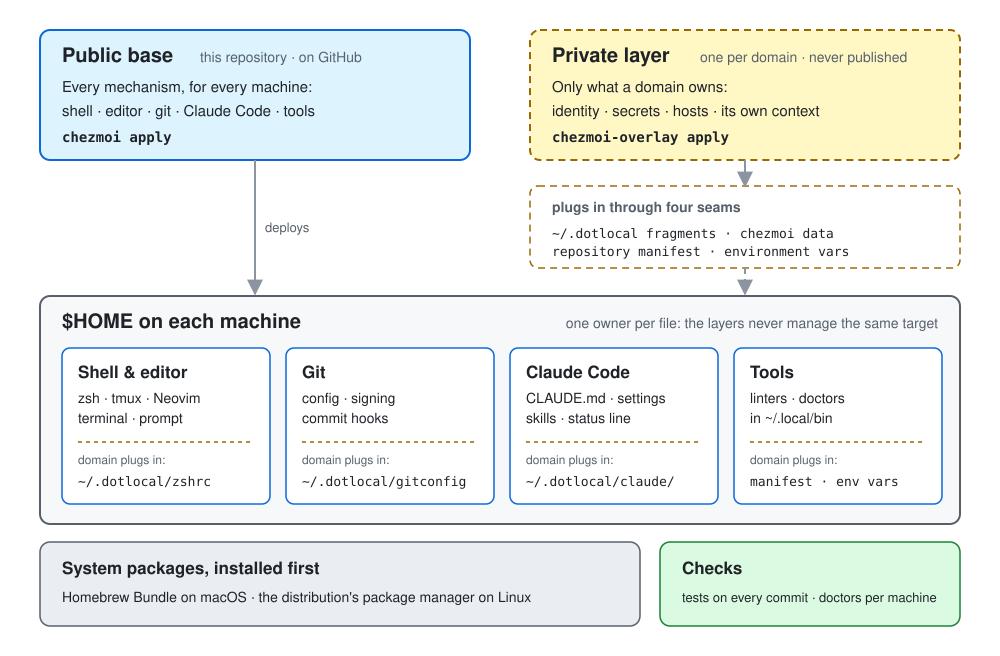
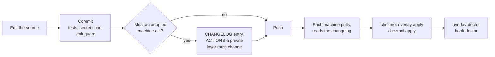

# Architecture

How this repository's configuration reaches a machine, how a private layer adds what only it can
know, and where each kind of content belongs. Read it before adding a file, a tool or a new place
for a domain to plug in.

<picture>
  <source media="(prefers-color-scheme: dark)" srcset="architecture-dark.svg">
  
</picture>

## Three layers

A machine is configured by three layers, each installed by its own tool:

1. **System packages**, installed first: Homebrew Bundle on macOS, from this repository's
   `Brewfile` plus a domain's `~/.dotlocal/Brewfile.role`; the distribution's package manager on
   Linux. chezmoi itself is one of these packages. This repository installs no packages.
2. **The public base**, this repository: a chezmoi *source state*, the directory chezmoi renders
   into the home directory. It holds every mechanism, meaning anything true of any machine: shell
   and editor configuration, git configuration and hooks, Claude Code's global configuration, and
   the command-line tools in `~/.local/bin`.
3. **A private layer**, one per *domain*. A domain is a set of machines that share an owner's
   private content, such as the home machines or one employer's machines. The layer is a second,
   independent chezmoi instance with its own source, config, state and cache, run with
   `chezmoi-overlay`. It holds what a domain alone has: identity and signing, secrets, hosts, and
   its own context (people, projects, conventions).

**Why a second instance and not one repository with private files mixed in.** The base is
published and the private layer never is. Two sources keep that boundary physical: nothing private
can be committed here by accident, because it is not in this tree. The two instances target the
same home directory, so **one owner per target file** is the rule: a file is managed by the base or
by the private layer, never both, since the second apply would silently replace the first.
`setup/overlay-doctor` reports a target both layers manage.

**Public by default.** A file goes in the base unless it carries one of five reasons to be private:
a secret, an identity, infrastructure only that domain has, the domain's program identifiers, or
the domain's own context. A mechanism with private content is split: the mechanism comes here, and
the private part reaches it through a seam.

## Seams: how a domain plugs in

A seam is a place where a base file reads something the private layer may supply. How to configure
each one, with formats and examples, is [`private-layer.md`](private-layer.md). Every base file
works when the private layer supplies nothing, so a machine with only the base is a working,
generic machine.

| Base file or tool | Reads | When the domain supplies nothing |
| --- | --- | --- |
| `~/.zshenv`, `~/.zprofile`, `~/.zshrc` | sources `~/.dotlocal/zshenv`, `zprofile`, `zshrc` | skipped; the prompt's machine tag falls back to the host name's first letter |
| `~/.gitconfig` | includes `~/.dotlocal/gitconfig` last, so it can override any base key: identity, signing key, whether to sign, a hook switched off | git ignores a missing include; commits carry no configured identity |
| `~/.ssh/config` | `Include ~/.dotlocal/ssh/config`: hosts and keys | only the generic `Host *` defaults |
| `Brewfile` | evaluates `~/.dotlocal/Brewfile.role` | the base packages only |
| `bootstrap-mac.sh` | runs `~/.dotlocal/bootstrap.d/*.sh` in order, after the apply | reports "core only" |
| `~/.claude/CLAUDE.md` | imports `~/.dotlocal/claude/CLAUDE.md` | Claude Code skips the import; the generic standards stand alone |
| `~/.claude/settings.json` | runs `~/.dotlocal/claude/settings-declared` for the domain's keys | the base's keys only |
| Skills | each reads `~/.dotlocal/skills/<skill>.md` for the domain's specifics | the generic procedure |
| `leak-guard`, `hook-doctor` | `~/.dotlocal/git-leak-*`: the terms to keep out, the private push destinations, a probe token | the guard passes every commit; hook-doctor reports `NOT-CONFIGURED` |
| `fleet-decl` and its callers | the repository manifest, `~/Devel/mani.yaml` (or `$FLEET_RECORD`); schema in [`fleet-manifest.md`](fleet-manifest.md) | callers that need it refuse; the others skip their per-repository step |
| Templates | chezmoi data: `domain`, `overlayRepo`, `skipSkills`, `dpi` | prompted at `chezmoi init`; `skipSkills` defaults to none |
| Many tools | an environment variable with a documented default (`CLAUDE_SETTINGS_FRAGMENT`, `HOOK_DOCTOR_*`, `MEMORY_DOCTOR_*`, …) | the default |

Four kinds, then: a **fragment file** under `~/.dotlocal/`, **chezmoi data**, the **repository
manifest** read through `fleet-decl`, and an **environment variable** with a default. Adding a seam
means picking one of these four, so a domain's layer always knows where to look.

## What an apply does

`chezmoi apply` renders the base in three phases:

1. **Before the files** (`run_before_*`): on macOS, `setup/check-required-brew-tools` stops the
   apply if a tool marked REQUIRED in the `Brewfile` is missing. Then `setup/preserve-claude-md`
   copies a hand-kept `~/.claude/CLAUDE.md` aside to `CLAUDE.md.before-base` before the base first
   replaces it.
2. **The files**: plain files are copied, `.tmpl` files rendered with chezmoi data, and
   `dot_claude/modify_settings.json` merges into `~/.claude/settings.json` rather than replacing it
   (below). Third-party content (oh-my-zsh, tmux's plugin manager, a pinned agent skill) comes from
   `.chezmoiexternal.toml.tmpl` as HTTP archives, so a refresh never needs git or a key.
   `.chezmoiignore` skips what a machine should not get: the repository's own files, Linux-only
   configuration on macOS, per-domain exclusions, and the skills a machine lists in `skipSkills`.
   `.chezmoiremove` deletes what was retired.
3. **After the files** (`run_once_after_*`, `run_onchange_after_*`): on first apply, clone and
   apply the private layer named by `overlayRepo` (skipped when there is none); regenerate
   worktrunk's configuration when its inputs change; verify the pinned skill.

`run_onchange_install-git-hooks.sh.tmpl` also writes this source repository's own `.git/hooks`.
The pre-commit hook runs the test suites, and the pre-push hook is a floor against pushing a private
key or the private layer's address.

The private layer is applied separately, with `chezmoi-overlay apply`. When a change moves a file
from one layer to the other, the `CHANGELOG.md` entry says which to apply first.

## What lands where

### Shell and editor

`~/.zshenv`, `~/.zprofile` and `~/.zshrc` are templates. Variation by OS or by purpose lives in
`.chezmoitemplates/<topic>.<scope>` fragments that the orchestrating template includes, so a diff
shows the scope in the file name. Neovim (LazyVim), Ghostty and the Linux window managers are
plain configuration under `dot_config/`, and tmux is `dot_tmux.conf`.

### Git

`~/.gitconfig` sets the shared behaviour (pager, merge style, pull and push defaults) and declares
git's *configured hooks*, which run in every repository without a per-clone install (git 2.54 or
later; older git ignores them without a word):

| Hook | Event | Does |
| --- | --- | --- |
| Hook name | Event | Does |
| --- | --- | --- |
| `ai-coauthor` | prepare-commit-msg | adds a co-author trailer, naming the model when it can, to a commit made from a Claude Code session; leaves a message that already has one alone |
| `secret-scan` | pre-commit | gitleaks over the staged changes, with a floor no repository config can weaken; refuses the commit if gitleaks is missing |
| `publish-guard-pre-commit`, `publish-guard-commit-msg`, `publish-guard-pre-push` | as named | `leak-guard`: the domain's private terms, outside the repositories allowed them; passes everything where the domain supplies no terms |
| `repo-gates-pre-commit`, `repo-gates-commit-msg`, `repo-gates-pre-push` | as named | `run-repo-gates`: a manifest repository's own tracked `.githooks/<event>` (or `.husky/<event>`) |

`hook-doctor` reports whether each is live per worktree.

**They run alongside a repository's own hooks, never instead of them.** A repository's hook
directory (`.git/hooks`, or the `core.hooksPath` husky sets) still runs as it always has. Where that
directory is the same gate `run-repo-gates` would run, the runner steps aside, so the gate runs once.
A repository with no `.githooks/<event>` or `.husky/<event>` gets nothing from `repo-gates-*`.

**Known edge:** for a repository that has a `.githooks/<event>` or `.husky/<event>` file not already
run by husky itself, `run-repo-gates` asks the fleet manifest (`~/Devel/mani.yaml`) whether to run it.
A repository not listed there is skipped with a one-line note. A machine with no manifest at all is
treated as an unreadable manifest, and the commit is refused (to be fixed: an absent manifest should
mean "nothing declared").

#### Switching a hook off

Every entry above can be switched off by name with `hook.<name>.enabled = false` (git 2.54+). The
scope decides how far it reaches:

| Reach | How |
| --- | --- |
| One repository | `git config hook.<name>.enabled false`, run inside it (undo with `git config --unset hook.<name>.enabled`) |
| Every repository on the machine | in `~/.dotlocal/gitconfig`, a `[hook "<name>"]` section with `enabled = false`. The private file is included at the END of `~/.gitconfig`, so it overrides the base |
| `repo-gates-*` for one command | `HUSKY=0 git commit …` (skips `run-repo-gates` only; the guard and the scan still run) |
| `ai-coauthor`, by its own switch | `ai-coauthor.enabled = false`, per repository or in `~/.dotlocal/gitconfig` for the whole machine. A domain whose commits already carry its own AI attribution turns it off this way |

Switching off a `publish-guard-*` entry removes the domain's publish guard for that scope: do it
deliberately, and switch it back on. Measured 2026-10-02 on git 2.55: a configured hook fired when
enabled, and did not fire with `enabled = false` set in the repository or in an included file read
after it.

### Claude Code

- **`~/.claude/CLAUDE.md`** holds the operating standards true on any machine, then imports
  `~/.claude/tooling.md` and the domain's fragment. Claude Code resolves imports at session start,
  so the parts never drift from an assembled copy.
- **`~/.claude/settings.json`** is written by Claude Code itself at runtime (`/model`, `/config`,
  permission grants), so a managed copy would fight it. The `modify_` script receives the live file
  and merges in order: live, then the base's keys, then the domain's. It never declares `model`
  (an administrator's managed policy may set it) or `permissions.allow` (the app appends to it, and
  a merge would replace the whole array).
- **Skills** in `~/.claude/skills/` are procedures an agent loads by name when their trigger
  applies. A machine excludes any it does not want with `skipSkills`.
- **`~/.claude/tooling.md`** is the inventory of every tool this repository installs.
  `tests/test-tooling-inventory.sh` fails when a tool is missing from it.
- **The status line** (`statusline-command.sh`) shows the model, directory, branch, context use and
  usage limits.

### Tools

Each tool in `private_dot_local/bin/` deploys to `~/.local/bin`; `tooling.md` lists them. Retiring
one takes two edits: delete the source, and add its target to `.chezmoiremove`, or the deployed copy
stays on `PATH`.

## The checks

| Check | When | Covers |
| --- | --- | --- |
| `tests/run-all.sh` | every commit here, unless only documentation changed | each tool, script and generated file |
| `secret-scan`, `leak-guard` | every commit and push, in every repository | plaintext secrets; a domain's private terms |
| `setup/overlay-doctor` | after pulling or changing either layer | the private layer's required pieces, its reasons to be private, both layers owning one file, the manifest's schema; `--machine` assesses git, tools and Claude Code |
| `hook-doctor` | on entering a worktree, once a day | whether each configured hook is live there |
| `context-lint` | when editing a context file or `docs/` | `AGENTS.md`, `CLAUDE.md` and the `docs/` layout |

## How a change reaches every machine

The base reaches a machine on its next pull; a private layer's change reaches only its own domain.
That asymmetry is why `CHANGELOG.md` exists: a base change that needs something new from every
private layer can only ask for it there. A machine weeks behind follows the catch-up walk in skill
`dotfiles-update`.

## Bringing in a new machine

`chezmoi init --apply <this repository>` prompts for the domain and the private layer's address,
applies the base, then clones and applies the private layer. A machine that already has
configuration (hand-placed files, another manager, an administrator's install) uses the guarded
flow in `setup/README.md` instead: audit what would be overwritten, back it up, show the diff,
confirm, apply. `setup/scaffold-overlay` starts a new domain's private layer from
`overlay-skeleton/`.
